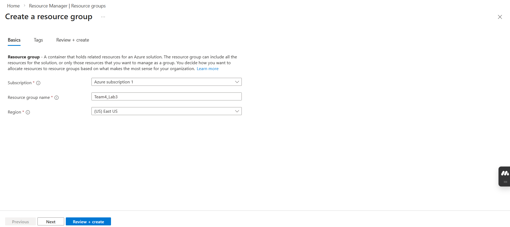

[⬅️ Back to Cloud Security](../)
# 🔥 Azure Firewall Implementation

**Organization:** Prafydob Corp  
**Duration:** 3 hours  
**Environment:** Microsoft Azure (East US)  
**Status:** ✅ Completed

---

## 📋 Project Overview

Implemented Azure Firewall as a centralized network security solution to control and filter inbound and outbound network traffic within a segmented Azure virtual network environment. This project demonstrates practical application of defense-in-depth principles and zero-trust network architecture.

---

## 🎯 Objectives

- Deploy Azure Firewall within a multi-subnet network architecture
- Implement User-Defined Routes to enforce traffic inspection
- Configure application-layer filtering based on FQDNs
- Establish network-layer rules for DNS resolution
- Validate security controls through comprehensive testing

---

## 🏗️ Architecture

### Network Topology
INTERNET
                   ↑
                   │ (Filtered Traffic)
                   │
          [Azure Firewall]
           Private IP: 10.0.1.4
                   ↑
                   │ (Forced Routing via UDR)
       ┌───────────┴───────────┐
       │                       │
[Workload VM]           [Jump Host VM]
10.0.2.4                10.0.3.4
(No Public IP)          (Public IP Enabled)
### Infrastructure Components

| Component | Specification | Purpose |
|-----------|---------------|---------|
| **Virtual Network** | 10.0.0.0/16 | Foundation network infrastructure |
| **AzureFirewallSubnet** | 10.0.1.0/26 (64 IPs) | Dedicated firewall subnet (mandatory naming) |
| **Workload-SN** | 10.0.2.0/24 (251 IPs) | Protected workload environment |
| **Jump-SN** | 10.0.3.0/24 (251 IPs) | Administrative access zone |
| **Azure Firewall** | Standard SKU | Centralized security control |
| **User-Defined Route** | 0.0.0.0/0 → 10.0.1.4 | Force all traffic through firewall |

---

## 🔧 Implementation Steps

### Phase 1: Network Infrastructure

**Virtual Network Creation**
- Created a segmented network with three isolated subnets
- Configured address space 10.0.0.0/16
- Established AzureFirewallSubnet with mandatory naming convention

📸 View Screenshots - Network Infrastructure (4 images)

*Resource group Team4_Lab3 created in East US region*

*Virtual network FW_Vnet with address space 10.0.0.0/16*

*Three subnets: AzureFirewallSubnet, Workload_SN, and Jump_SN*

---

**Virtual Machine Deployment**
- **WorkloadVm**: Deployed in Workload_SN (10.0.2.4) without public IP
- **JumpHostVm**: Deployed in Jump_SN (10.0.3.4) with public IP for administrative access

📸 View Screenshots - Virtual Machines (2 images)

*WorkloadVm with private IP only - no direct internet exposure*

*JumpHostVm with public IP for controlled administrative access*

---

### Phase 2: Azure Firewall Deployment

**Firewall Configuration**
- Deployed Azure Firewall Standard SKU
- Created dedicated public IP address (FW_PIP) with static assignment
- Assigned private IP 10.0.1.4 within AzureFirewallSubnet

📸 View Screenshots - Firewall Setup (3 images)

*Standard SKU public IP with static assignment for firewall*

*Azure Firewall deployment in progress*

---

### Phase 3: Traffic Routing Configuration

**User-Defined Route Implementation**
- Created route table "Firewall-Route"
- Configured custom route with destination 0.0.0.0/0 (all internet traffic)
- Set next hop to Virtual Appliance (10.0.1.4)
- Associated route table with Workload_SN only

📸 View Screenshots - Routing Configuration (2 images)

*Custom route forcing all internet traffic through firewall*

*Route table associated with Workload_SN subnet*

---

### Phase 4: Firewall Rules Configuration

**Application Rule Collection** (Layer 7 Filtering)
- Collection: App-Coll01 (Priority: 200, Action: Allow)
- Rule: Allow-Bing
  - Source: 10.0.2.0/24 (Workload subnet)
  - Protocols: HTTP (80), HTTPS (443)
  - Target FQDN: www.bing.com
  - Effect: Permits access only to Bing.com, denies all other domains

📸 View Screenshot - Application Rules (1 image)

*Application rule allowing only www.bing.com access*

---

**Network Rule Collection** (Layer 3/4 Filtering)
- Collection: Net-Coll01 (Priority: 200, Action: Allow)
- Rule: Allow-DNS
  - Source: 10.0.2.0/24
  - Protocol: UDP
  - Destination: 209.244.0.3, 209.244.0.4 (Level 3 DNS servers)
  - Port: 53
  - Effect: Enables domain name resolution

**Technical Rationale:** DNS resolution is a prerequisite for FQDN-based application rules. Without this network rule, the workload VM cannot resolve domain names, making the application rule ineffective.

📸 View Screenshot - Network Rules (1 image)

*Network rule permitting DNS queries to external resolvers*

---

## ✅ Testing & Validation

### Connectivity Testing

**Access Method:** Multi-hop RDP connection
1. RDP from workstation → JumpHostVm (public IP)
2. RDP from JumpHostVm → WorkloadVm (10.0.2.4, internal network)

📸 View Screenshots - Connection Setup (2 images)

*RDP connection to Jump Host from external workstation*

*Internal RDP connection from Jump Host to Workload VM*

---

### Permitted Traffic Test

**Test Case:** Access www.bing.com from WorkloadVm

**Expected Result:** ✅ Successful page load

**Validation:**
- DNS resolution functioned correctly (Allow-DNS rule operative)
- Firewall application rule permitted HTTPS traffic to www.bing.com
- Custom route successfully directed traffic through the firewall
- Return traffic properly routed back to VM

📸 View Screenshot - Successful Access (1 image)

*Microsoft Edge successfully loading www.bing.com - application rule working correctly*

---

### Denied Traffic Tests

**Test Case 1:** Access www.google.com from WorkloadVm

**Expected Result:** ❌ Connection timeout

**Validation:**
- Firewall correctly evaluated FQDN against application rule collection
- No rule matched www.google.com destination
- Default-deny behaviour enforced
- Connection blocked before reachingthe  internet

📸 View Screenshot - Blocked Access (1 image)

*Connection to www.google.com blocked - default-deny behaviour confirmed*

---

**Test Case 2:** Access www.microsoft.com from WorkloadVm

**Expected Result:** ❌ Connection timeout

**Validation:** Consistent denial of unpermitted domains confirms whitelist model operation

📸 View Screenshot - Blocked Access (1 image)

*Connection to www.microsoft.com also blocked - whitelist model validated*

---

## 🔐 Security Architecture Analysis

### Defense-in-Depth Implementation

The project demonstrates multiple security layers:

**Layer 1 - Network Segmentation**  
Three isolated subnets with distinct security boundaries

**Layer 2 - Access Control**  
Workload VM has no public IP, eliminating direct internet exposure

**Layer 3 - Traffic Inspection**  
User-Defined Routes force all outbound traffic through centralised inspection point

**Layer 4 - Application Filtering**  
FQDN-based rules provide specific web access control

**Layer 5 - Protocol Filtering**  
Network rules control lower-level communications (DNS)

**Layer 6 - Administrative Control**  
Jump host pattern provides controlled, auditable administrative access

---

### Zero Trust Principles

- **Default Deny**: Firewall denies all traffic except explicitly allowed
- **Least Privilege**: Workload systems have the minimum necessary network access
- **Microsegmentation**: Subnet-level isolation with different security policies
- **Explicit Verification**: Each connection is evaluated against defined rules

---

## 💡 Key Learnings

### Technical Insights

**Azure Firewall Architecture**
- Mandatory subnet naming (AzureFirewallSubnet) is a technical requirement, not a convention
- Rule processing order: Network rules evaluated before application rules
- Stateful operation maintains connection state for return traffic

**User-Defined Routing**
- Next hop virtual appliance enables forced traffic inspection
- Route tables are applied at the subnet level for specific control
- UDRs override default Azure routing behaviour

**Security Implementation**
- Multiple independent controls provide defence redundancy
- Jump host pattern balances security with operational access
- Default-deny posture requires intentional action to grant access

---

## 🛠️ Technologies Used

- **Cloud Platform**: Microsoft Azure
- **Security Services**: Azure Firewall (Standard SKU), Network Security Groups
- **Networking**: Azure Virtual Networks, User-Defined Routes, DNS
- **Compute**: Windows Server 2025 Datacenter VMs
- **Protocols**: RDP (TCP 3389), HTTP/HTTPS (80/443), DNS (UDP 53)
- **Management**: Azure Portal, PowerShell, Azure CLI

---

## 📊 Project Outcomes

✅ Successfully deployed segmented network with three isolated subnets  
✅ Implemented centralized traffic inspection through Azure Firewall  
✅ Configured FQDN-based web filtering (whitelist model)  
✅ Established protocol-level access controls  
✅ Validated security controls through comprehensive testing  
✅ Demonstrated defense-in-depth architecture  
✅ Proved zero-trust network access implementation  

---

## 🔗 Related Projects

- [Cloud Security Overview](../)
- [Microsoft Defender for Cloud Implementation](../)
- [Threat Intelligence Projects](../../threat-intelligence/)

---

[⬅️ Back to Cloud Security Projects](../) | [🏠 Home](../../)
