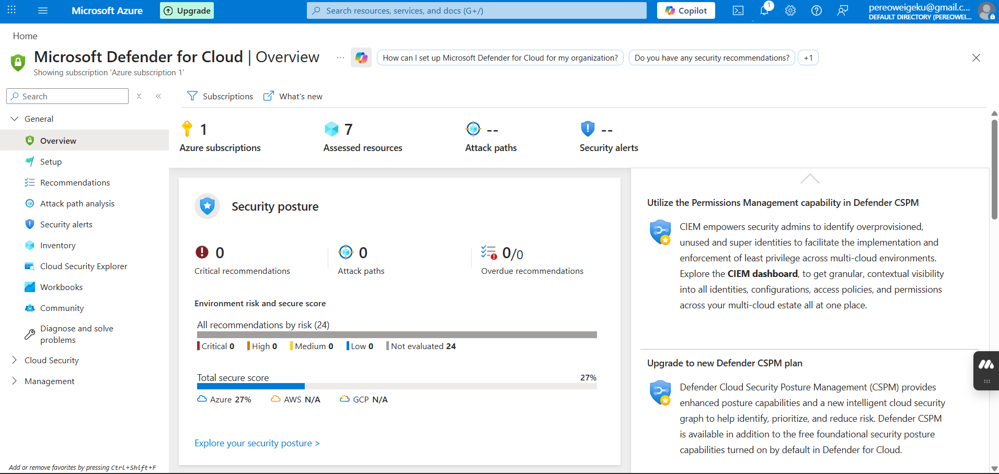
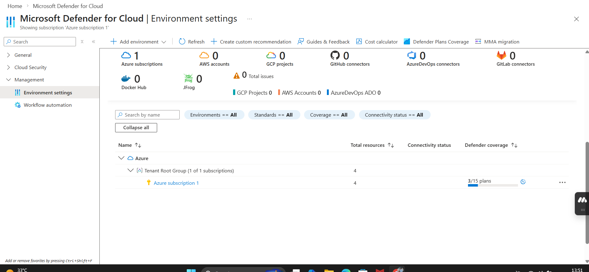
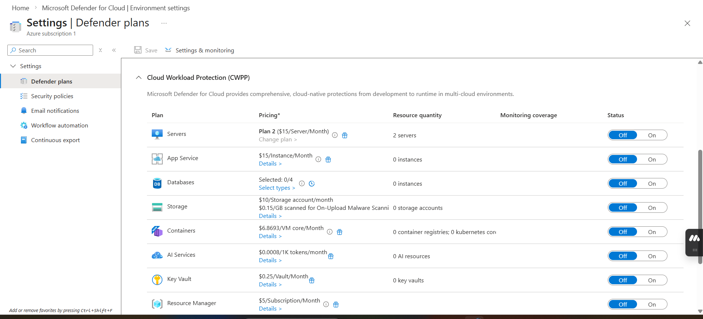
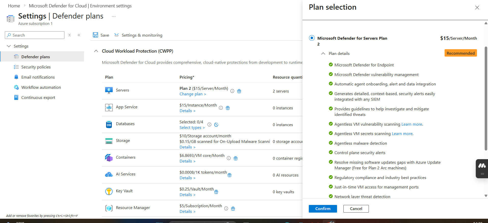
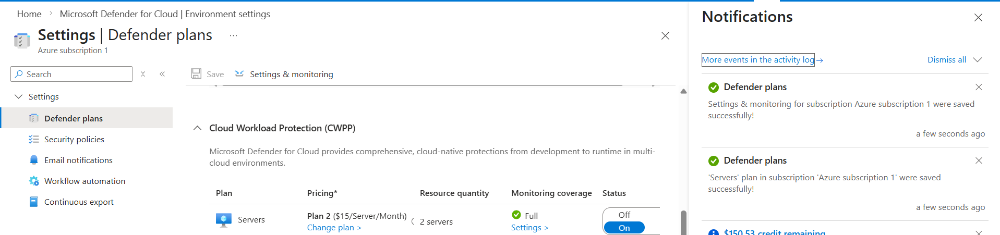
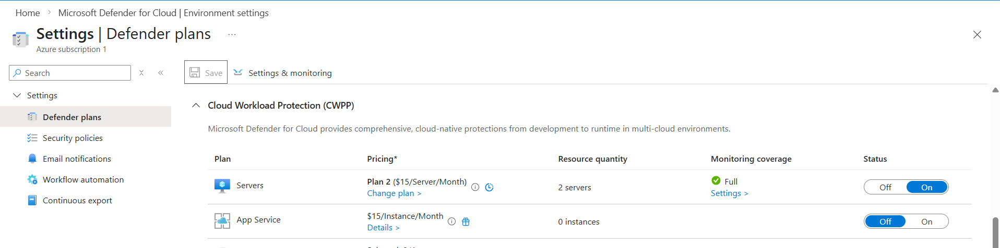
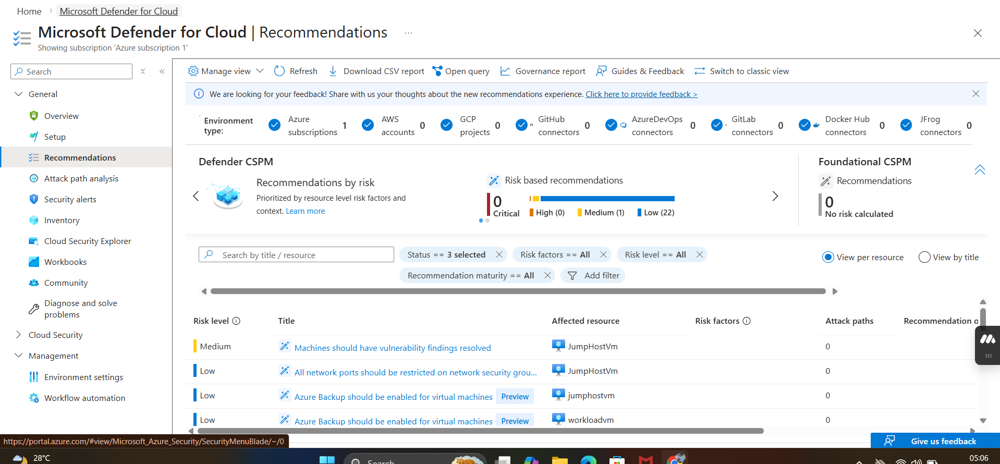




# 🛡️ Microsoft Defender for Cloud

**Organization:** Prafydob Corp
**Duration:** 30 minutes
**Environment:** Microsoft Azure
**Status:** ✅ Completed

---

## 📋 Overview

Prafydob Corp's Azure infrastructure needed more than network controls.
The virtual machines running business operations require active
protection against threats that network rules alone cannot stop.
This implementation activated Microsoft Defender for Cloud Plan 2
at the subscription level, providing enterprise-grade threat
protection across all current and future virtual machines
without requiring infrastructure changes.

---

## 🎯 Objectives

- Enable Microsoft Defender for Cloud enhanced security features
- Activate Defender for Servers Plan 2 at the subscription level
- Establish continuous vulnerability assessment
- Enable Just-in-Time VM access to reduce the attack surface
- Verify active monitoring through the recommendations interface

---

## 🔐 Why This Matters for Prafydob Corp

Prafydob Corp processes customer transactions and handles sensitive
data as an e-commerce business. A network firewall controls
traffic in and out, but cannot detect threats already inside
the environment. Microsoft Defender for Cloud fills this gap
by continuously monitoring server behaviour, scanning for
vulnerabilities, and alerting on suspicious activity. This
moves Prafydob Corp from reactive to proactive security.

---

## 🏗️ Security Architecture Context

This implementation sits on top of the existing network security
controls established in previous labs.

<table>
  <thead>
    <tr>
      <th>Layer</th>
      <th>Implementation</th>
      <th>Responsibility</th>
    </tr>
  </thead>
  <tbody>
    <tr>
      <td><strong>Azure Subscription</strong></td>
      <td>Prafydob Corp</td>
      <td>Contains all resources</td>
    </tr>
    <tr>
      <td><strong>Network Layer</strong></td>
      <td>Azure Firewall (Lab 03)</td>
      <td>Controls what traffic enters and exits</td>
    </tr>
    <tr>
      <td><strong>Threat Protection Layer</strong></td>
      <td>Defender for Cloud (This Lab)</td>
      <td>Monitors activity inside the environment</td>
    </tr>
  </tbody>
</table>

**Capabilities activated in this layer:**

<table>
  <thead>
    <tr>
      <th>Capability</th>
      <th>Function</th>
    </tr>
  </thead>
  <tbody>
    <tr>
      <td><strong>Threat Detection</strong></td>
      <td>Identifies suspicious behaviour on servers</td>
    </tr>
    <tr>
      <td><strong>Vulnerability Assessment</strong></td>
      <td>Scans for security weaknesses</td>
    </tr>
    <tr>
      <td><strong>Just-in-Time VM Access</strong></td>
      <td>Closes management ports when not in use</td>
    </tr>
    <tr>
      <td><strong>File Integrity Monitoring</strong></td>
      <td>Detects unauthorised file changes</td>
    </tr>
  </tbody>
</table>
---

## 🔧 Implementation Steps

### Phase 1: Accessing Microsoft Defender for Cloud

Microsoft Defender for Cloud was accessed through the Azure
Portal search bar. The overview page displayed the current
security posture dashboard, giving initial visibility into
the subscription's security status.

📸 View Screenshot - Defender for Cloud Overview

<em>Defender for Cloud overview showing current security posture</em>

---

### Phase 2: Environment Settings Configuration

The Management section was accessed through the left navigation
sidebar. Environment settings was selected to reach
subscription-level configurations. The settings page displayed
a hierarchical structure representing the Azure tenant. The
subscription node was expanded to reveal all available
Defender plan configurations.

📸 View Screenshot - Environment Settings

<em>Environment settings displaying tenant and subscription structure</em>

---

### Phase 3: Activating Defender for Servers Plan 2

Within the Defender plans interface the Servers plan was
identified in the Cloud Workload Protection list showing
a status of Off. This confirmed that enhanced server
protection was not yet active for the subscription.

📸 View Screenshot - Servers Plan Before Activation

<em>Servers plan in Off state prior to activation</em>

The server's plan was toggled from Off to On. The system
automatically configured Plan 2, the most comprehensive
protection tier available. Plan 2 was selected because it
includes advanced capabilities that Plan 1 does not offer.

📸 View Screenshot - Plan 2 Features

<em>Defender for Servers Plan 2 selected with full feature set</em>

The configuration was saved using the Save button at the
top of the settings page. A success notification confirmed
the Defender plans were updated successfully.

📸 View Screenshot - Save Confirmation

<em>Success notification confirming Defender plans updated</em>

---

### Phase 4: Verifying the Deployment

The server's plan entry was checked to confirm the status
change. The interface now showed the Server's plan as On
with Plan 2 clearly indicated.

📸 View Screenshot - Servers Plan After Activation

<em>Servers plan active with Plan 2 enabled</em>

The Recommendations blade was accessed to observe the
security features working. The JumpHostVM and WorkloadVM
from the Azure Firewall implementation appeared immediately
with associated risk factors and improvement opportunities.
This confirmed Defender for Cloud was actively monitoring
the infrastructure.

📸 View Screenshot - Security Recommendations

<em>Active recommendations for JumpHostVM and WorkloadVM confirming live monitoring</em>

---

## 🔒 Security Capabilities Enabled

### Threat Detection and Behavioural Analytics
Defender for Cloud continuously analyses server behaviour
looking for unusual patterns. This includes unusual login
attempts, suspicious process creation, and potential malware
activity. The detection engine uses Microsoft's global threat
intelligence to identify known attack patterns.

### Vulnerability Assessment
Virtual machines are automatically scanned for security
weaknesses, including missing patches, outdated software,
and misconfigurations. The assessment engine prioritises
findings, so the most critical vulnerabilities are addressed
first.

### Just-in-Time VM Access
Management ports are kept closed by default. When
administrative access is needed, a time-limited request
opens only the required port for a specific IP address.
The port closes automatically when the time window expires.
This eliminates the constant exposure of management ports
to the internet.

### File Integrity Monitoring
Critical system files and registry keys are continuously
monitored for changes. Any unauthorised modification
generates an alert. This is particularly effective at
detecting threats that attempt to establish persistence
by modifying system files.

### Adaptive Application Controls
The system observes which applications run legitimately in
the environment and creates policies to block anything
outside that approved list. This provides protection
against malicious software attempting to execute on
protected servers.

### Security Posture Management
The Secure Score metric measures overall security health
across the subscription. Recommendations are automatically
generated and prioritised, giving the security team a
clear action list for improving Prafydob Corp's security
posture over time.

---

## 📊 Results and Validation

| Capability | Status | Verification Method |
|------------|--------|-------------------|
| Threat Detection | ✅ Active | Overview dashboard |
| Vulnerability Assessment | ✅ Active | Recommendations blade |
| Just-in-Time VM Access | ✅ Active | VM configuration page |
| File Integrity Monitoring | ✅ Active | Plan 2 feature list |
| Adaptive Application Controls | ✅ Active | Plan 2 feature list |
| Security Posture Management | ✅ Active | Secure Score displayed |

**Verification Outcome:** Both JumpHostVM and WorkloadVM
appeared in the Recommendations interface with active
risk assessments. This confirmed Defender for Cloud was
monitoring workloads and performing continuous security
assessments within minutes of activation.

---

## 💡 Key Learnings

### Subscription-Level Activation is Powerful
Activating at the subscription level means every new
virtual machine was added to Prafydob Corp's environment
automatically receives protection. There is no risk of
new resources being deployed without monitoring.

### Complementary to Network Controls
Azure Firewall from Lab 03 controls traffic between
the network and the internet. Defender for Cloud monitors
activity within the virtual machines themselves. These
two controls together create much stronger protection than
either one alone. A threat that bypasses network rules
will still be detected by Defender for Cloud's behavioural
monitoring.

### Proactive Over Reactive
The recommendations interface gave an immediate list of
security improvements with clear priority levels. This
shifts the team from responding to incidents after they
happen to address weaknesses before attackers can
exploit them.

---

## 🔗 Related Projects

- [Azure Firewall Implementation](../azure-firewall-implementation/)
- [Cloud Security Overview](../)
- [Home](../../)

---



<a href="#" class="back-to-top">↑</a>
